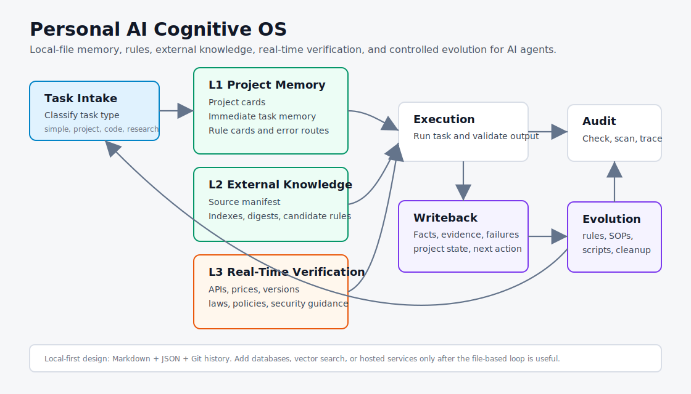

# Personal AI Cognitive OS

A local-file template for giving AI agents durable project memory, explicit rules, error-route recall, external knowledge, real-time verification, and controlled evolution.

This is not a chat-log dump and it is not a private hard drive published to GitHub. It is a sanitized template for building an AI memory operating layer with Markdown, JSON, project cards, rule cards, audit logs, and a static dashboard.

## Why This Exists

AI agents are useful, but long-running work often breaks down in predictable ways:

- The context window runs out before the project is done.
- Rules drift because old decisions, new rules, and temporary ideas are mixed together.
- Completed work is not written back into memory, so the next session starts cold.
- Failed approaches are not recorded, so the same dead ends get retried.
- External knowledge is scattered across docs, GitHub repos, papers, and websites.
- Fresh facts such as API changes, prices, laws, and platform rules are not separated from stable local rules.
- Personal systems become hard to migrate because they depend on hidden app state.

This template solves those problems with a simple local folder structure.

## Core Idea



```text
Task intake
-> task classification
-> L1 project memory and rules
-> L2 local external knowledge
-> L3 real-time verification when needed
-> execution and validation
-> fact writeback
-> error-route recording
-> rule, SOP, and project-state updates
-> periodic audit and controlled evolution
```

## Memory Layers

| Layer | Name | Purpose |
|---|---|---|
| L1 | Project memory and rules | Project cards, immediate task memory, stable rules, preferences, decisions, and error routes |
| L2 | Local external knowledge | Downloaded or distilled docs, GitHub repos, papers, digests, indexes, and source manifests |
| L3 | Real-time verification | Current APIs, prices, laws, platform rules, software versions, security guidance, and news |

L1 answers: what has this person or project already decided?  
L2 answers: what trusted knowledge has already been collected locally?  
L3 answers: what may have changed and needs verification now?

## Cognitive Mapping

| Cognitive function | Template implementation |
|---|---|
| Working memory | Current task context and current project focus |
| Episodic memory | Immediate task memory, progress logs, and `source_trace` |
| Semantic memory | Knowledge cards, stable rules, and long-term principles |
| Procedural memory | SOPs, scripts, workflows, and repeatable processes |
| Error memory | Failed paths, anti-patterns, and routes to avoid |
| Consolidation | Task-end writeback, project-card updates, rule upgrades |
| Forgetting / suppression | `review`, `deprecated`, `archived`, and `deleted_reference_only` states |
| Reflection / evolution | Weekly audit, rule convergence, SOP upgrades, and error-route promotion |

## Repository Structure

```text
.
├─ AGENTS.md
├─ system
│  ├─ 00_control
│  ├─ 01_memory
│  ├─ 02_projects
│  ├─ 03_external_knowledge
│  ├─ 04_output_assets
│  ├─ 05_audit
│  ├─ 06_evolution
│  └─ 07_realtime_research
├─ examples
│  ├─ sample_data
│  └─ sample_project
├─ scripts
├─ docs
└─ public
```

## Quickstart

Requirements:

- Node.js 18 or newer
- A terminal that can run `npm`

Run the checks:

```powershell
npm run check
```

Generate the dashboard:

```powershell
npm run dashboard
```

Open the generated file:

```text
public/index.html
```

## What To Customize

- Copy `examples/sample_project` into a real project folder.
- Edit `system/00_control/rule_cards.json` for your own agent operating rules.
- Add project handoff notes to `system/01_memory/project_handoff.md`.
- Add task-end summaries to `system/01_memory/immediate_task_memory_index.md`.
- Record failed approaches in `system/01_memory/error_routes.md`.
- Track external sources in `system/03_external_knowledge/sources_manifest.md`.
- Record high-change verification rules in `system/07_realtime_research`.
- Log system improvements in `system/06_evolution/evolution_log.md`.

## Proof Case

See [docs/proof-case.md](./docs/proof-case.md) for a small end-to-end example:

```text
wrong path
-> error memory
-> corrected path
-> rule update
-> project state update
-> dashboard evidence
```

## What Not To Publish

Do not put these into a public repository:

- Passwords, API keys, tokens, cookies, verification codes, private keys, or seed phrases.
- Full private chat transcripts.
- Customer data, family information, payment screenshots, identity documents, addresses, or phone numbers.
- Real local paths that expose private user names or private directory structure.
- Business details that have not been sanitized.

Public repositories should contain templates, fake data, sanitized examples, scripts, and documentation.

## Main Entry Points

- [AGENTS.md](./AGENTS.md): operating rules for AI agents.
- [Cognitive model](./docs/cognitive-model.md): memory and evolution model.
- [Architecture](./docs/architecture.md): layers, modules, and data flow.
- [Proof case](./docs/proof-case.md): minimal closed-loop example.
- [Publication checklist](./docs/publication-checklist.md): pre-release checks.
- [Rule cards](./system/00_control/rule_cards.json): short operational rules.
- [Immediate task memory](./system/01_memory/immediate_task_memory_index.md): task-end writeback index.
- [Error routes](./system/01_memory/error_routes.md): failed paths and anti-patterns.
- [Evolution log](./system/06_evolution/evolution_log.md): rule and SOP upgrades.
- [Release notes](./docs/release-notes.md): version history.

## GitHub Topics

Suggested topics:

```text
ai-agent
agent-memory
context-engineering
personal-ai
local-first
knowledge-management
markdown
workflow
audit-log
ai-productivity
```

## Status

Current version: `v0.1.0`.

This is a public MVP template. It can validate the repository structure, run a sensitive-content scan, and generate a static dashboard. It does not contain private memory or customer data.
